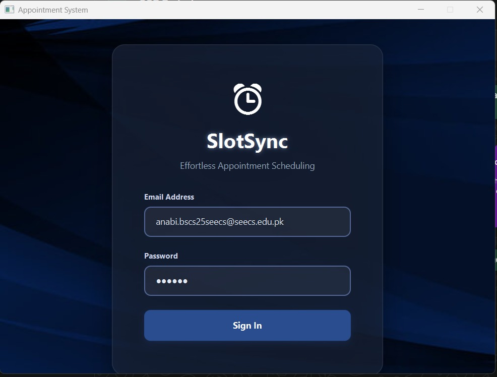
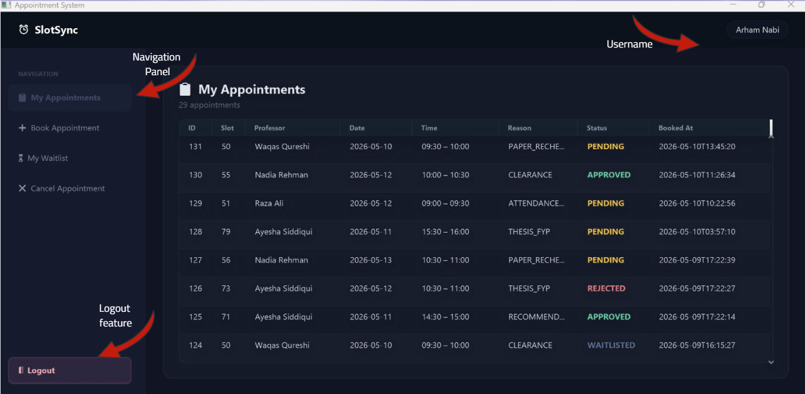
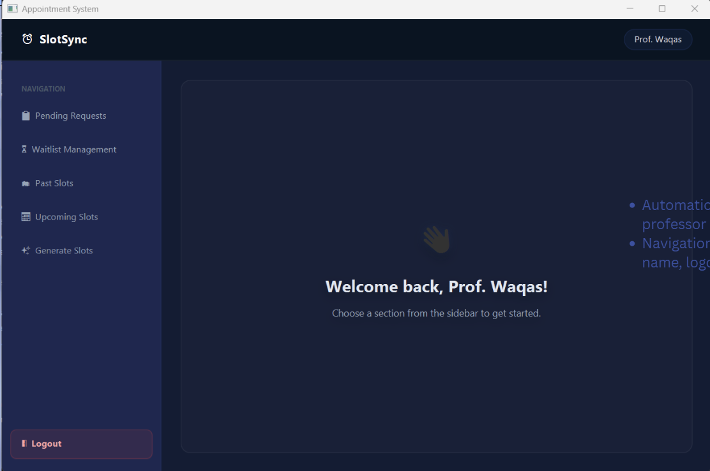

# SlotSync – Smart Appointment Scheduling System

SlotSync is a centralized appointment scheduling system designed to manage student–professor meetings in a structured and conflict-free manner. It improves fairness, reduces scheduling inefficiencies, and optimizes the utilization of faculty office hours.

---

## Overview

SlotSync addresses the limitations of traditional or manual scheduling systems by introducing structured booking, prioritization, and automated slot management.

### Screenshots

| View | Preview |
|------|--------|
| Login Screen |  |
| Student Dashboard |  |
| Professor Dashboard |  |
| Booking Flow |  |

> Replace the image paths with your actual screenshots in an `/images` folder.

---

## Problem Statement

Traditional appointment systems often lack structure and automation, leading to:

- Overlapping or double-booked appointments  
- No clear distinction between urgent and routine requests  
- Wasted time slots due to cancellations  
- No waitlist or reassignment mechanism  
- Poor visibility of availability  
- Inefficient use of faculty office hours  

---

## Features

- Centralized scheduling between students and professors  
- Conflict detection to prevent overlapping bookings  
- Priority-based appointment handling  
- Waitlist support for high-demand slots  
- Automatic slot reassignment after cancellations  
- Configurable slot generation using JSON  
- Structured and consistent user interface  

---

## System Architecture

The project follows a layered architecture to ensure separation of concerns and maintainability.

### Package Structure

- `dao/` – Database access layer (SQL operations only)  
- `model/` – Core entities (Student, Professor, Appointment, Slot)  
- `service/` – Business logic (scheduling, authentication, waitlist, slot handling)  
- `view/` – JavaFX UI components  
- `enums/` – Status and type definitions  
- `priority/` – Priority handling logic  
- `main/` – Application entry point  
- `resources/` – External assets (CSS, images, JSON files)  

---

## Core Components

- `DBConnection.java` – Manages MySQL database connection  
- `common_slots.json` – Defines configurable slot generation rules  
- `styles.css` – Centralized styling for JavaFX UI  
- `.env` – Stores sensitive configuration (excluded from version control)  
- `pom.xml` – Maven build and dependency management  

---

## Database Design

- Centralized MySQL database hosted on AWS  
- DAO pattern used to isolate database logic from application logic  
- All queries executed using dedicated DAO classes  
- No SQL logic inside UI or service layers  

### Security Practices

- Prepared statements used for all queries  
- Protection against SQL injection attacks  
- Parameterized queries using placeholders (`?`)  

### Transaction Management

- Commit and rollback implemented for data consistency  
- Ensures reliable booking and cancellation operations  

---

## Design Patterns

- DAO (Data Access Object) Pattern  
- Layered architecture (MVC-inspired structure)  
- Service layer for business logic separation  

---

## Tech Stack

- Java  
- JavaFX  
- MySQL (AWS hosted)  
- Maven  
- JSON  
- CSS  

---

## Project Structure

```text
src/
├── dao/
├── model/
├── service/
├── view/
├── enums/
├── priority/
├── main/
└── resources/
